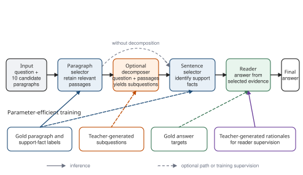

# Architecture

Bactrainus separates evidence selection from answer generation so that paragraph, sentence, and answer errors remain observable. The implementation targets the HotpotQA distractor protocol, where every instance supplies a bounded candidate set rather than an open corpus. The official training source contains two to ten candidate paragraphs (89,609 of 90,447 contain ten), so this is a fixed-candidate selector--reader system rather than an open-domain retriever.

## Task representation

Let one instance be

$$
x=(q,D,a,S,P),
$$

where:

- \(q\) is the question;
- \(D=\{d_1,\ldots,d_{10}\}\) is the supplied candidate set;
- \(a\) is the reference answer;
- \(S\) is the set of supporting facts represented as `(title, sentence_index)` pairs;
- \(P\subset D\) is the set of gold paragraphs.

Each paragraph is serialized as \(d_j=(t_j,s_{j1},\ldots,s_{jn_j})\), preserving its exact title and zero-based sentence indices.

## Modular maps

The principal pipeline is

$$
\widehat P=f_P(q,D;\theta_P),
$$

$$
U=f_Q(q,\widehat P;\theta_Q),
$$

$$
\widehat S=f_S(q,\widehat P,U;\theta_S),
$$

$$
\widehat a=f_R\!\left(q,C(\widehat P,\widehat S);\theta_R\right).
$$

The variables have explicit interface meanings:

- \(\widehat P\): selected paragraph titles;
- \(U=(u_1,\ldots,u_m)\): optional ordered subquestions;
- \(\widehat S\): selected supporting-fact pairs;
- \(C\): a deterministic evidence serializer;
- \(\widehat a\): concise predicted answer.

When question decomposition is disabled, \(U=\varnothing\). Two reader interfaces are supported conceptually:

- `facts`: serialize only the sentences in \(\widehat S\);
- `paragraphs`: serialize every sentence in the paragraphs in \(\widehat P\).

The facts interface is the primary modular interface because it reduces avoidable context noise. The paragraph interface is retained as a diagnostic condition.

## Alternative factorizations

The repository also represents two comparisons:

- A single-stage selector predicts both paragraph and sentence decisions: \((\widehat P,\widehat S)=f_{PS}(q,D;\theta_{PS})\).
- An all-in-one baseline predicts supporting facts and the answer in one generation: \((\widehat S,\widehat a)=f_J(q,D;\theta_J)\).

The modular path corresponds to the architectural factorization

$$
\begin{aligned}
p(\widehat P,U,\widehat S,\widehat a\mid q,D)
={}&p_{\theta_P}(\widehat P\mid q,D)\,
p_{\theta_Q}(U\mid q,\widehat P)\\
&\times p_{\theta_S}(\widehat S\mid q,\widehat P,U)\,
p_{\theta_R}(\widehat a\mid q,C).
\end{aligned}
$$

This factorization exposes interfaces; it is not a statistical-independence claim. Upstream predictions define the inputs seen by downstream modules.

## Component contracts

### Paragraph selector

Input: the question and all ten supplied candidates.

Output: an ordered, deduplicated list of exact candidate titles. A parser rejects unknown titles rather than silently substituting a fuzzy match.

### Question decomposer

Input: the original question and selected paragraphs.

Output: a bounded ordered list of concise subquestions. The original question remains available to the sentence selector; decomposition does not replace it.

### Sentence selector

Input: the question, selected paragraphs, and optional subquestions.

Output: exact `(title, sentence_index)` pairs. Titles and indices are validated against the supplied candidate set. Malformed, duplicate, or nonexistent references are handled explicitly.

### Reader

Input: the question and serialized selected evidence.

Output: a concise answer string. Rationale-supervised variants may learn an explanation-plus-answer target, but generated rationales are not gold evidence and are not evaluated as supporting facts.

## Integrated scenarios

The revised manuscript defines six interface scenarios independently of model size:

| ID | Selector path | Decomposition | Reader evidence |
|---:|---|---:|---|
| 1 | All-in-one joint generation | No | Internal |
| 2 | Single-stage paragraph + sentence selection | No | Facts |
| 3 | Paragraph-to-sentence cascade | No | Facts |
| 4 | Paragraph-to-sentence cascade | No | Paragraphs |
| 5 | Paragraph-to-decomposition-to-sentence cascade | Yes | Facts |
| 6 | Paragraph-to-decomposition-to-sentence cascade | Yes | Paragraphs |

The machine-readable definitions are in [`configs/experiments/integration_scenarios.yaml`](../configs/experiments/integration_scenarios.yaml).

## Engineering boundaries

The code follows four rules:

1. Model backends implement a small batched generation protocol and do not own task parsing.
2. Parsers validate generated text against the instance that produced it.
3. Pipeline orchestration composes components but does not implement metric logic.
4. Answer, evidence, joint, and calibration metrics remain side-effect-free and backend-independent.

These boundaries allow a backend, prompt, or parser to change without silently changing every other stage.
